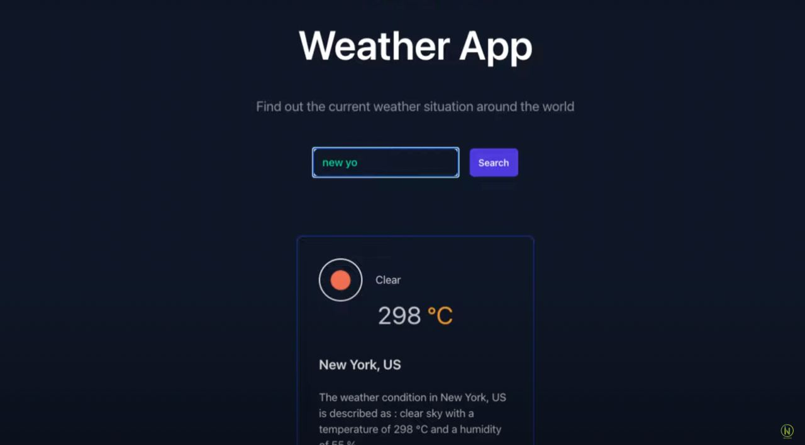

# ABB Tech Academy Full Stack
Homework and etc. for ABB Tech Academy Full Stack Course

# Homework 1

- Getting started with npm and gulp

# Homework 2

- Using npm and gulp to create a simple web server and using sass to create a simple web page

# Homework 3

# Answers to theoretical questions:

## 1. How Prototypical Inheritance Works in JavaScript

Prototypical inheritance is a mechanism in JavaScript that allows objects to inherit properties and methods from other objects. In JavaScript, every object has an internal link to another object called its prototype. When a property or method is accessed on an object, and it doesn't exist on that object itself, JavaScript will look for it in its prototype.

The prototype chain is formed by linking objects together through their prototypes. If a property or method is not found in the current object's prototype, JavaScript will continue searching up the chain until it either finds the desired property or reaches the end of the chain (i.e., the object's prototype is null).

This mechanism allows objects to inherit properties and methods from their prototypes, creating a hierarchical relationship between objects. By modifying the prototype of an object, changes can be made to the behavior of all objects that inherit from it.

## 2. The Purpose of Calling super() in a Child Class Constructor

In JavaScript, when creating a child class that extends a parent class, it is necessary to call the `super()` function within the child class constructor. The `super()` function is used to call the constructor of the parent class and initialize the inherited properties and methods defined in the parent class.

By calling `super()`, the child class ensures that the parent class's constructor is executed, allowing the child class to inherit the parent's properties and methods. This initialization step is crucial to establish the proper state and behavior of the child class.

Additionally, calling `super()` enables the child class to pass any required arguments to the parent class constructor, ensuring that the parent class is properly initialized based on the specific requirements of the child class.

# 8th of August 2023, Practical Session (folder name: PW_8AUGUST)

# ABB Tech Academy

## Task: Weather App

1. Setup and Initial Components:
   - Set up your project using create-react-app or your preferred tool.
   - Create the necessary directory structure and initial files.
   - Install required packages: redux, react-redux, redux-thunk.
2. UI Components:
   - Design UI components, including a search bar and weather display area.
   - Create a component for the search bar where users can input a location.
   - Create a component to display weather information, like temperature, description, and an icon.

    Something like this:
    

3. Create Redux Store:
   - Create a Redux store and configure reducers for managing weather data.
4. Redux Actions and Action Creators:
   - Create Redux action types (e.g., `FETCH_WEATHER_REQUEST`, `FETCH_WEATHER_SUCCESS`, `FETCH_WEATHER_FAILURE`).
   - Implement action creators for these actions.
5. Integrate Redux Thunk:
   Create a Redux Thunk action to fetch weather data.
   - Use the axios library to make API requests to 
   - OpenWeatherMap. Set up the API URL with the base URL (https://api.openweathermap.org/data/2.5).
6. Create Search Input and Button:
   - In the search bar component, create an input field where users can type a location (city or zip code).
   - Add a button that users will click to initiate the weather search.
7. Fetch Weather Data on Button Click:
   - Attach an event handler to the search button.
   - When the button is clicked, dispatch the Redux Thunk action to fetch weather data using the input value.
8. Display Weather Information:
   - Update the weather display component to show fetched weather information.
   - Display temperature, weather description, and an icon based on the condition.
9. Error Handling:
   - Handle API request errors and display error messages to users.
10. Loading:
    - Handle API request loading and display loading message to users.
11. Optional Enhancements:
    - Display additional weather information like humidity and wind speed.
    - Implement a 5-day weather forecast view.
